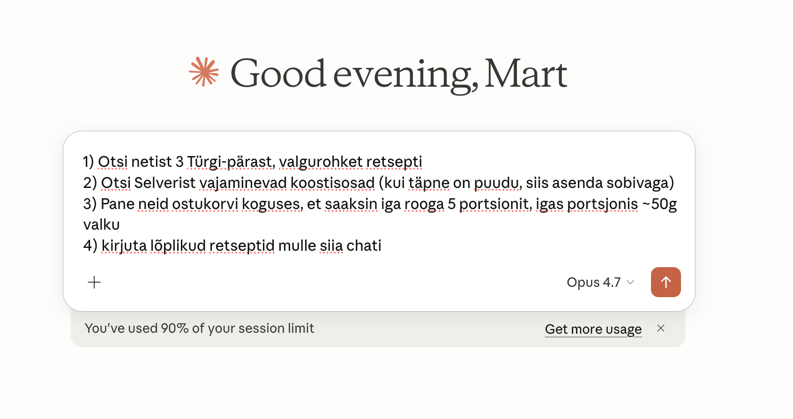
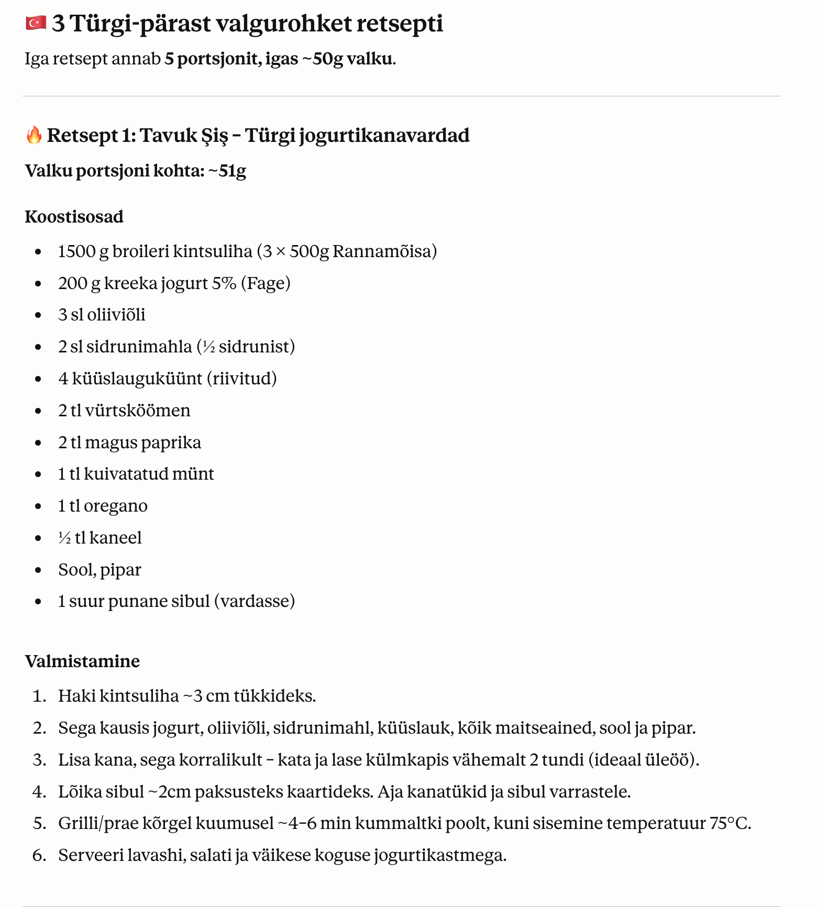
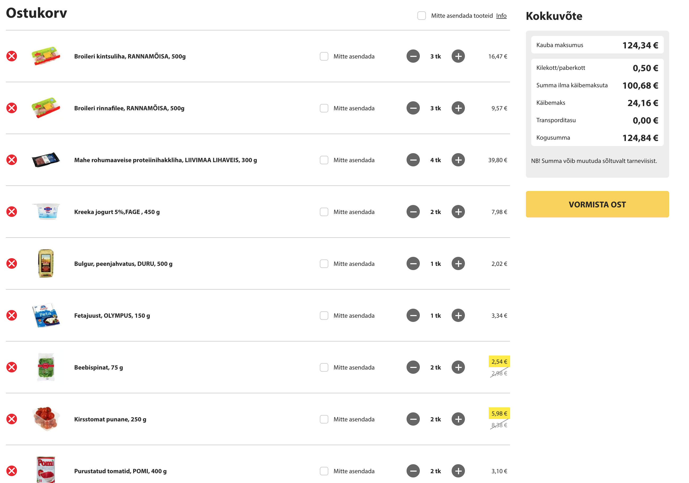

# selver-mcp

Let Claude shop at Estonian online grocery stores for you: **Selver**, **Rimi**, and **Barbora**. Search products, compare prices across stores, build a shopping cart in one or several stores, and open it in your browser ready for checkout - all from a conversation with Claude.

Coop is not included: its Tallinn, Tartu, and Pärnu e-shops run on Wolt and Bolt Food; only Haapsalu has its own web shop.

**Works with:** Claude Desktop, Claude Code, and any MCP-compatible client.

## What you get

You tell Claude something like *"add two loaves of bread and half a kg of cucumber to my Selver cart and open it"* and Claude:

1. Searches the stores you name with each store's own search engine
2. Picks the best options and sizes quantities correctly (weight goods in kg, fixed steps)
3. Builds the cart: on Selver's servers as a guest cart; on Rimi and Barbora inside your browser tab
4. Opens Chrome with the cart visible, ready for you to log in and pay

Or ask *"price this list in Selver and Rimi and tell me which is cheaper"* and Claude runs the comparison before building anything.

No credentials leave your machine. selver-mcp never sees your store passwords. Barbora requires you to log in in the browser tab before items can be added.

## A real example: Turkish high-protein meal prep

Once installed, you can chain selver-mcp with Claude's normal capabilities. A real session:

**1. The prompt** (in Estonian - works equally well in English):



> 1) Otsi netist 3 Türgi-pärast, valgurohket retsepti
> 2) Otsi Selverist vajaminevad koostisosad (kui täpne on puudu, siis asenda sobivaga)
> 3) Pane neid ostukorvi koguses, et saaksin iga rooga 5 portsionit, igas portsjonis ~50g valku
> 4) kirjuta lõplikud retseptid mulle siia chati

**2. Claude's reply** - real Estonian recipes with measured ingredients and steps:



**3. The cart, populated and ready for checkout** - opens automatically in Chrome after Claude finishes reasoning:



All in one conversation. Claude handles recipe research, ingredient mapping to real SKUs (substituting when exact matches are out of stock), weight-based quantity math, and the browser orchestration that shows you the cart ready to check out.

## Easiest install: let your AI agent do it

If you already have an AI coding agent with shell and filesystem access - **Claude Code** works out of the box, Claude Desktop works if you have a filesystem or shell MCP installed - the fastest install is to paste this prompt:

> Please install selver-mcp from https://github.com/martparve/selver-mcp following its README. Set up both MCPs (selver-mcp and chrome-devtools) for my client, and do the post-install step for getting the cart workflow into context (skill file for Claude Code, memory for Claude Desktop). Then tell me to restart.

The agent will clone the repo, run `npm install && npm run build`, wire up the MCPs in your config file, and handle the workflow-in-context step appropriate for your client.

If your agent doesn't have those permissions (browser-only ChatGPT, Claude.ai web, etc.), fall back to the manual steps below.

## Prerequisites

You need **Node.js 18 or newer**. Check if you have it:

```bash
node --version
```

If you see `v18.x.x` or higher, you're set. Otherwise:

- **macOS**: easiest is [Homebrew](https://brew.sh) → `brew install node`
- **Windows / Linux / any OS**: download from [nodejs.org](https://nodejs.org) (pick the LTS version)

## Install - Claude Code

### 1. Download selver-mcp

```bash
git clone https://github.com/martparve/selver-mcp.git ~/selver-mcp
cd ~/selver-mcp
npm install
npm run build
```

### 2. Connect it to Claude Code

```bash
claude mcp add selver-mcp node ~/selver-mcp/dist/index.js
```

### 3. Install the browser helper

selver-mcp builds your cart on Selver's servers, but to actually **see and check out** the cart, Claude needs a browser-control helper called `chrome-devtools-mcp`:

```bash
claude mcp add chrome-devtools --scope user -- npx -y chrome-devtools-mcp@latest
```

### 4. Install the skill (optional)

The server already sends the workflow to Claude Code as MCP instructions. The skill adds examples and pitfalls on top.

```bash
mkdir -p ~/.claude/skills/selver-cart
cp ~/selver-mcp/skills/selver-cart/SKILL.md ~/.claude/skills/selver-cart/SKILL.md
```

### 5. Restart Claude Code and try it

> Lisa mulle Selverist 2 pätsi musta leiba ja ava cart

or

> Add 2 black breads from Selver to my cart and open it in the browser

Claude should search, add, open a Chrome window showing your cart, and tell you to log in.

## Install - Claude Desktop

### 1. Download selver-mcp

Same as Claude Code step 1.

### 2. Find your Claude Desktop config file

- **macOS**: `~/Library/Application Support/Claude/claude_desktop_config.json`
- **Windows**: `%APPDATA%\Claude\claude_desktop_config.json`

If the file doesn't exist, create it.

### 3. Add both MCPs to the config

```json
{
  "mcpServers": {
    "selver-mcp": {
      "command": "node",
      "args": ["/Users/YOUR_NAME/selver-mcp/dist/index.js"]
    },
    "chrome-devtools": {
      "command": "npx",
      "args": ["-y", "chrome-devtools-mcp@latest"]
    }
  }
}
```

Replace `/Users/YOUR_NAME/selver-mcp` with the actual path where you cloned the repo. On Windows this looks like `C:\\Users\\YourName\\selver-mcp` (double backslashes).

### 4. Restart Claude Desktop

That is all. The server tells Claude Desktop the full workflow itself (MCP server instructions), so no memory or skill file is needed.

### 5. Try it

> Lisa mulle Selverist 2 pätsi leiba ja ava cart

The first time MCP tools are used, Claude Desktop will ask permission - click Allow.

## How to verify it works

Ask Claude in a new chat:

> What Selver tools do you have available?

Claude should list eight tools: `search_products`, `get_products`, `compare_prices`, `add_to_cart`, `view_cart`, `remove_from_cart`, `clear_cart`, `get_browser_sync_script`. Plus a bunch of `chrome-devtools` tools.

## Usage examples

**Build a shopping cart and open the browser:**
> Leia mulle Selverist 5 erinevat juustu ja ava cart brauseris.

**Compare stores:**
> Pane see nimekiri kokku Selveris ja Rimis ja ütle, kus on odavam: 2 kanafileed, kilo tomateid, 2 täispiima.

**Shop at Rimi:**
> Lisa Rimist 0,6 kg kurki ja 2 piima carti ja ava see.

**Just search, don't commit:**
> Mis on praegu Selveris odavaim kreeka jogurt?

**Remove items:**
> Võta kurk ostukorvist välja.

**Start fresh:**
> Tühjenda mu Selveri cart.

### Tips

- Use Estonian search terms: `leib` (bread), `piim` (milk), `muna` (egg), `kanafilee` (chicken fillet)
- The cart persists between conversations - pick up tomorrow where you left off
- Weight goods (cucumber, meat, loose vegetables) are ordered in kg in fixed steps, usually 0.3 kg. Claude handles the math and the server snaps odd amounts up to the next valid step.

## Troubleshooting

**"The browser is already running" error**

Left over from a previous session. Close any orphan Chrome windows manually, or run:

```bash
pkill -f 'chrome-devtools-mcp/chrome-profile'
```

**Cart is empty in the browser even though Claude added items**

The browser step was skipped. Remind Claude: *"call get_browser_sync_script and run the replay_script in the selver.ee cart tab"*.

**"Toote samm on muutunud" error when adding weight goods**

The quantity was not a multiple of the product's step. `add_to_cart` normally prevents this; if it appears, ask Claude to resend using the product's `qty_step`.

**Items marked out of stock**

`in_stock` comes from Selver's live stock service for the e-shop. Ask Claude for a substitute.

**npm or claude command not found**

Node.js (see Prerequisites) or the Claude Code CLI is not installed or not on your PATH.

## Updating

```bash
cd ~/selver-mcp
git pull
npm install
npm run build
```

Then restart Claude Code or Claude Desktop. If you copied the skill file, copy it again.

## Uninstall

**Claude Code:**

```bash
claude mcp remove selver-mcp
claude mcp remove chrome-devtools
rm -rf ~/selver-mcp
rm -rf ~/.claude/skills/selver-cart
```

**Claude Desktop:** remove the `selver-mcp` and `chrome-devtools` entries from `claude_desktop_config.json` and delete `~/selver-mcp`.

Your guest cart token lives at `~/.selver-mcp/cart.json`. Delete that to start completely fresh.

---

## For developers

### Tools

Every tool takes a `store` (`selver`, `rimi`, `barbora`); search tools take `stores`.

| Tool | Description |
|------|-------------|
| `search_products` | Search one or more stores with each store's own engine. Returns price, discount, unit price, `qty_step`/`min_qty`/`sold_by_weight`, `in_stock`, category, nutrition (Selver), URL. `sort`: relevance, price_asc, price_desc. |
| `get_products` | Same product record for a list of SKUs in one store. |
| `compare_prices` | Price a shopping list (`items: [{query, qty}]`) across stores: top candidates per line per store with line totals and an estimated total per store. |
| `add_to_cart` | Selver: puts lines in the guest cart server-side (`mode: set` default, `mode: add`), snaps quantities, returns the cart with real totals. Rimi/Barbora: resolves products and returns `browser.script` to run in the store's tab. |
| `view_cart` | Selver: lines and grand total. Rimi/Barbora: a read script for the tab. `store: "all"` lists every store. |
| `remove_from_cart` / `clear_cart` | Selver: server-side. Rimi/Barbora: returns a script for the tab. |
| `get_browser_sync_script` | Selver: steps and JavaScript that make the server cart visible in a browser. Rimi/Barbora: steps to open the store tab and read the cart. |

### Store adapters

| Store | Search | Cart | Notes (verified October 2026) |
|---|---|---|---|
| Selver | Klevu + Vue Storefront catalog + live stock | Server-side guest cart, token held by the MCP, replayed into the SPA | Bag fee 0.50 €. Nutrition available. |
| Rimi | Server-rendered search page parsed from HTML (`/epood/ee/otsing`) | Guest cart bound to an httpOnly Laravel session: in-page `PUT /epood/cart/change` + `GET /epood/cart/refresh` with the `XSRF-TOKEN` cookie | Minimum order 20 €. Unavailable items show "Ei ole saadaval". |
| Barbora | Product list embedded in the search page (`window.b_productList`) | No guest cart; in-page calls to `/api/eshop/v1/cart/*` in a logged-in tab | 4 € fee under 39.99 €. Many promo prices need the loyalty card. Rate-limits bursts with empty 200 pages, so requests are throttled to 2 in parallel with retries. Cart JSON shape unverified until a logged-in run. |
| Coop | not supported | | ecoop.ee redirects to Wolt/Bolt; Haapsalu runs WooCommerce (Store API, guest cart) and could be added on request. |

### How Selver's stack works (verified October 2026)

- **Search:** the website's search box uses [Klevu](https://www.klevu.com) (`POST https://eucs3v2.ksearchnet.com/cs/v2/search` with a public client-side key). The Vue Storefront Elasticsearch proxy at `/api/catalog/vue_storefront_catalog_et/product/_search` holds the full product records (nutrition, unit prices, discounts, `product_weight_step`) but its `q=` ranking is poor, so selver-mcp uses Klevu for ranking and the catalog for details. The catalog is the fallback when Klevu is down.
- **Stock:** the catalog index's stock fields are stale. Live availability and ordering rules come from `GET /api/stock/list?skus=A,B,C` (literal commas; one unknown SKU fails the whole call).
- **Weight goods:** `product_weight_step` is a string (`"0.30"`). Quantities are in kg and must be multiples of the step, otherwise Selver answers `Toote samm on muutunud (0.3)`.
- **Cart:** `/api/cart/{create,update,pull,delete,totals}`. `update` without `item_id` *adds* to an existing line; with `item_id` it *sets* the quantity. `pull` prices exclude VAT; `totals` has the real numbers and the packaging fee.
- **Browser:** the Vue 2 SPA keeps its own cart state and ignores a guest server cart. The replay script sets the token in `localStorage` and the store (`cart/cart/SRV_TOKEN`), then replays `/api/cart/pull` items through `cart/getProductVariant` + `cart/addItem {forceServerSilence: true}`, fixes quantities with `cart/updateQuantity`, removes stale lines, and calls `cart/syncTotals`. When the user logs in, Vue Storefront merges the guest cart into their account.

### Build from source

```bash
npm install      # install dependencies
npm run build    # compile TypeScript to dist/
npm test         # unit tests against captured API fixtures (tests/fixtures)
npm run dev      # watch mode
```

### Architecture

```
src/
├── index.ts                  # MCP server entry point (stdio transport)
├── core/
│   ├── types.ts              # Product, StoreAdapter, ServerCartApi, BrowserCartApi
│   ├── qty.ts                # quantity snapping and rounding
│   └── http.ts               # throttled fetch with retries and bot-challenge detection
├── tools/
│   ├── search.ts             # search_products, get_products, compare_prices
│   └── cart.ts               # add_to_cart, view_cart, remove_from_cart, clear_cart, get_browser_sync_script
├── stores/
│   ├── registry.ts           # store id → adapter
│   ├── selver/               # Klevu search, catalog hydration, live stock, guest cart, SPA replay script
│   ├── rimi/                 # HTML search parser, in-page cart script
│   └── barbora/              # embedded-JSON search parser, in-page cart script
└── storage/
    └── cart-token.ts         # ~/.selver-mcp/carts.json (per-store server cart tokens)
```
